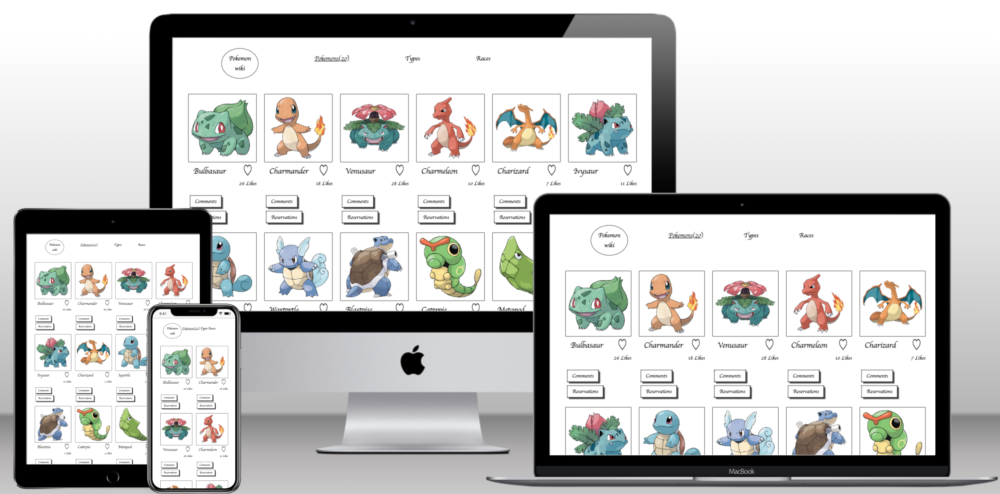

# Project Name

> Pokemon Website.

## Description

- This project is built using PokeAPI for pokemons and Involvement API for interactions.
- In this project you can view different Pokemons and their abilities.
- You can give a like to your favourite pokemons.
- You can also share your thoughts on the pokemon by leaving comments on it.

## Built With

- HTML, CSS, JavaScript
- Webpack
- Jest
- RESTFUL APIs

### Prerequisites

- Vistual Studio Code
- Browser (Firefox / Google Chrome)
- Node.js (v6.11.2+)
- linters

## Getting Started

To get a local copy up and running follow these simple example steps.

## Install Dependencies(with following Command)

- npm install --save -dev

## Build webpack

- run command npm run build

## Start server

- npm start

## To test the app run following command

- npm test

### Usage

Showcase Pokemons and their abilites. You can like and post comments on each pokemon.

## Feature Video

Click this [Video](https://drive.google.com/file/d/1a7RdEyUAWa7g6i99kc4qzchwkugp2BVP/view?usp=sharing) to see a descriptive video about the features of the website 

## Live Demo

Click here to see the [Live Demo](https://shella12.github.io/Pokemon.github.io/dist/) of the website 

## Authors

👤 **Author1**

- GitHub: [@shella12](https://github.com/shella12)
- Twitter: [@Ayesha Arshad](https://twitter.com/AyeshaA03712974)
- LinkedIn: [Ayesha Arshad](https://www.linkedin.com/in/ayesha-arshad-a690a015a/)

**Author2**

- GitHub: [@altontonn](https://github.com/altontonn)
- Gmail: [Newton Alumasa](altontonnalumasa@gmail.com)

## 🤝 Contributing

Contributions, issues, and feature requests are welcome!

Feel free to check the [issues page](../../issues/).

## Show your support

Give a ⭐️ if you like this project!

## 📝 License

This project is [MIT](./LICENSE) licensed.

_NOTE: we recommend using the [MIT license](https://choosealicense.com/licenses/mit/) - you can set it up quickly by [using templates available on GitHub](https://docs.github.com/en/communities/setting-up-your-project-for-healthy-contributions/adding-a-license-to-a-repository). You can also use [any other license](https://choosealicense.com/licenses/) if you wish._
